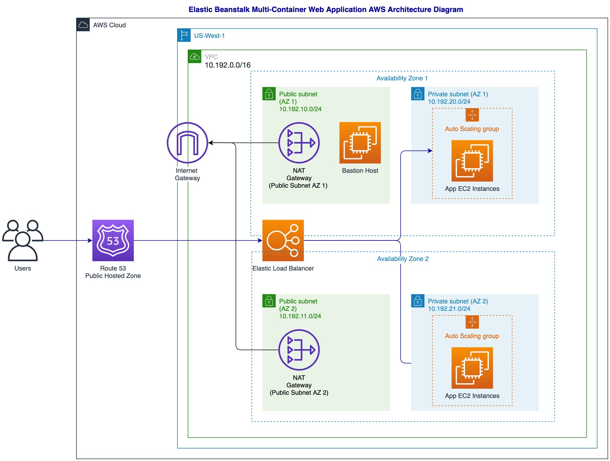

# Elastic Beanstalk Multi-Container Web Application

## Project Overview
This project launches the [Multi-Container PHP-FPM + Nginx](https://github.com/aws-samples/eb-docker-nginx-proxy) AWS sample app in AWS Elastic Beanstalk.
The [Elastic Beanstalk app](cf_templates/elasticbeanstalk.yaml) template is used with the [AWS VPC](cf_templates/cloudformation-vpc-template.yaml), [bastion host](cf_templates/bastion-host-with-ASG.yaml), and [Route 53](cf_templates/route53.yaml) templates to create the following architecture:

## Acceptance Criteria
* The application is deployed to docker containers running on AWS EC2 instances that're launched as part of an Auto Scaling Group (ASG) with min size 2 and max size 6.
* The application EC2 instances, elastic load balancer, EC2 auto scaling groups, security groups, CloudWatch alarms and log groups, IAM roles and SNS topic are all created as part of the [elasticbeantalk](cf_templates/elasticbeanstalk.yaml) CloudFormation template.
* The application is highly available by resource redundancy across 2 availability zones. 
The elastic load balancer sends health check request every 10 seconds to monitor the health of the application's EC2 instances.
The application EC2 auto scaling group is configured to use Elastic Load Balancing (ELB) health checks. If the  ELB health check reports an instance as unhealthy, the auto scaling group will replace the instance.
 
    * The classic load balancer health check settings are as follows:
    
        | Health Checking Setting | Value |
        | ------------- | ------------- |
        | Ping Target  | HTTP:80/  |
        | Timeout  | 5 seconds  |
        | Interval  | 10 seconds  |
        | Unhealthy threshold  | 5  |
        | Healthy threshold  | 3  |

    * The EC2 auto scaling group is configured to have a minimum size of 2 instances and a maximum size of 6 instances.
        * The group's autoscaling settings are as follows:
            * When the sum of Elastic Beanstalk application request count is higher than 15 for 1 minute, the ASG will add 1 instance to the group and then wait 5 minutes before allowing another scaling activity.
            * When the sum of Elastic Beanstalk application request count is lower than 10 for 1 minute, the ASG will remove 1 instance from the group and again wait 5 minutes before the next scaling activity.

    In summary, the ELB health check, Elastic Beanstalk application scaling triggers, and resource availability across multiple AZs together make the web application highly available.

## CI/CD with AWS CodePipeline
The application is automatically built and deployed using AWS CodePipeline.
The README documentation can be found under [code_pipeline/README.md](code_pipeline/README.md) 
