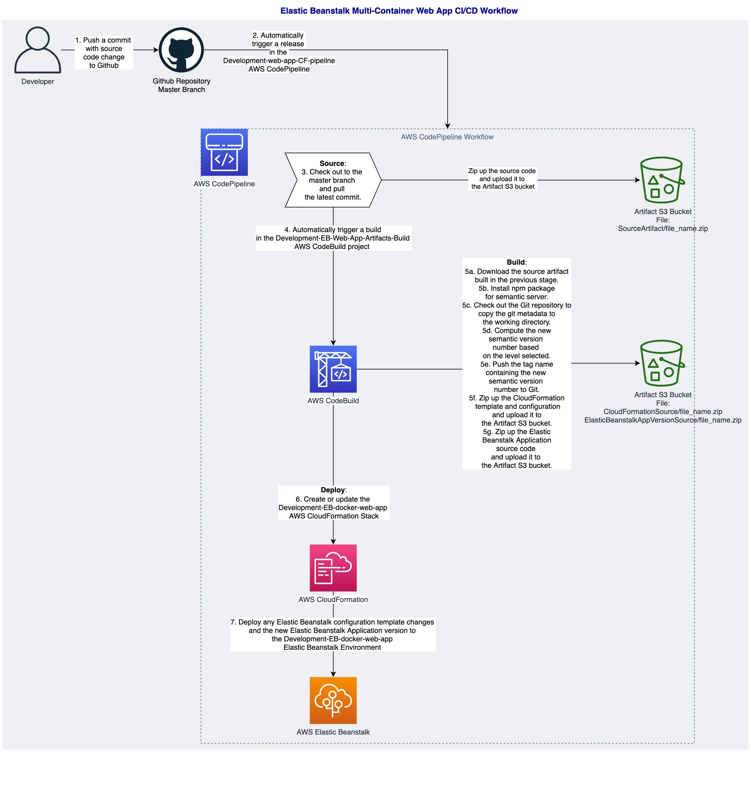

# AWS CodePipeline WorkFlow for Elastic Beanstalk Web Application CI/CD

This workflow diagram below shows the stages in the AWS CodePipeline that 
automatically builds the CloudFormation and Elastic Beanstalk Application
artifacts and deploys the code changes to the CloudFormation stack.

The CloudFormation stack creates the Elastic Beanstalk Application for the [Multi-Container PHP-FPM + Nginx](https://github.com/aws-samples/eb-docker-nginx-proxy) AWS sample app. 

